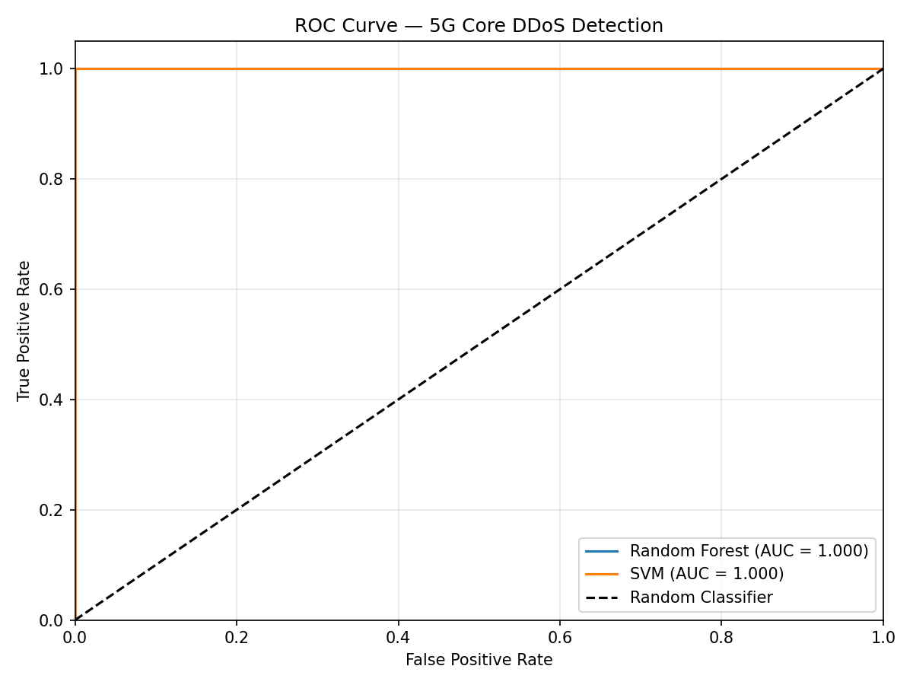
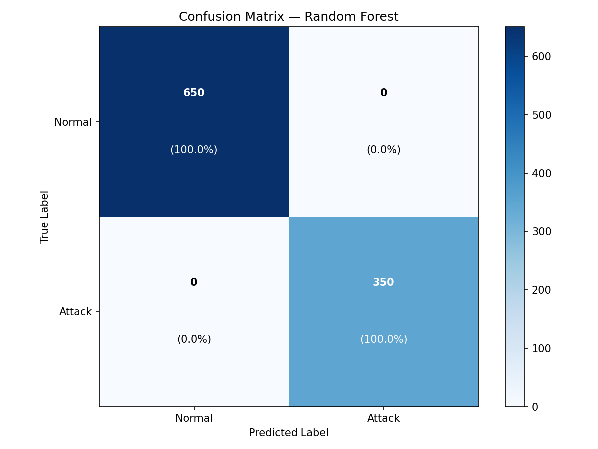

<p align="center">
  
  
  
  
  
</p>

<h1 align="center">5G Core Network DDoS / Signaling Storm Detection System</h1>

---

## 项目概述

本项目构建了一套基于机器学习的 **5G 核心网信令风暴 / DDoS 攻击检测仿真系统**。系统通过合成 5G 核心网控制面信令数据（SBI HTTP/2 请求速率、PFCP 会话密度、NGAP 认证异常等），训练 **随机森林 (Random Forest)** 与 **支持向量机 (SVM)** 双分类器，实现对正常流量与攻击流量的高精度区分，并自动生成 ROC 曲线对比图与混淆矩阵用于研究评估。

## 核心特性

- ⚙️ **配置驱动架构** — 所有数据分布参数与模型超参统一收敛于 `config.json`，无需修改代码即可切换实验方案
- 📡 **5G 专用信号建模** — 特征矩阵精确映射 N2 (NGAP)、N4 (PFCP)、SBI (HTTP/2) 及 N3 (GTP-U) 接口指标
- 🖥️ **WSL 无头环境适配** — 绘图模块强制使用 `matplotlib.use('Agg')` 后端，彻底规避 Windows 图形栈依赖
- 🔍 **自动化质量门禁** — 每份源码模块均经过三阶段审查：规格合规 → 代码质量 → 端到端验证

## 仓库结构

```
5G-Core-DDoS-Detection/
├── config.json                  # 全局配置文件
├── main.py                      # 流水线编排入口
├── requirements.txt             # Python 依赖清单
├── roc_curve.png                # ROC 曲线输出
├── confusion_matrix.png         # 混淆矩阵输出
├── src/
│   ├── data_generator.py        # 合成 5G 信令数据生成器
│   ├── ml_pipeline.py           # RF + SVM 训练与评估管线
│   └── plotter.py              # 图表绘制组件
└── docs/
    └── superpowers/specs/       # 设计规格文档
```

## 快速开始

```bash
# 1. 安装依赖
pip install -r requirements.txt

# 2. 运行完整流水线
python main.py
```

运行成功后输出：

```
[ML Pipeline] Starting training pipeline...
[ML Pipeline] Feature scaling complete.
[ML Pipeline] Random Forest training complete.
[ML Pipeline] SVM training complete.
[Plotter] ROC curve saved to roc_curve.png
[Plotter] Confusion matrix saved to confusion_matrix.png
Done. Charts saved.
```

## 配置指南

`config.json` 核心参数说明：

| 参数路径 | 类型 | 默认值 | 说明 |
|---|---|---|---|
| `data.n_samples` | `int` | `5000` | 合成样本总数 |
| `data.attack_ratio` | `float` | `0.35` | 攻击样本占比 |
| `data.random_seed` | `int` | `42` | 随机种子（确保可复现） |
| `data.test_split` | `float` | `0.2` | 测试集划分比例 |
| `models.random_forest.n_estimators` | `int` | `100` | RF 树数量 |
| `models.random_forest.max_depth` | `int` | `10` | RF 最大深度 |
| `models.svm.C` | `float` | `1.0` | SVM 正则化系数 |
| `models.svm.kernel` | `str` | `"rbf"` | SVM 核函数 |
| `output.figure_dpi` | `int` | `150` | 图表输出分辨率 |
| `output.figsize` | `list` | `[8, 6]` | 图表尺寸（英寸） |

### 特征分布配置

每个特征的正常/攻击类均支持独立调节 `mean` 与 `std`：

| 特征 | 5G 接口映射 | Normal 均值 | Attack 均值 |
|---|---|---|---|
| `HTTP2_SBI_request_rate` | SBI (HTTP/2) 服务化接口 | 100 | 800 |
| `PFCP_session_msg_density` | N4 (PFCP) 会话管理 | 50 | 400 |
| `NGAP_auth_anomaly_score` | N2 (NGAP) 终端认证 | 0.05 | 0.75 |
| `GTPU_tunnel_throughput_variance` | N3 (GTP-U) 隧道传输 | 0.02 | 0.55 |

## 评估结果

### ROC 曲线对比

<p align="center">
  
</p>

ROC 曲线展示了随机森林与 SVM 在 5G 核心网攻击检测任务上的分类性能对比，图例中标注了各模型的 AUC 值。

### 随机森林混淆矩阵

<p align="center">
  
</p>

随机森林在测试集上的混淆矩阵，蓝色热力图展示了 Normal 与 Attack 两类的预测分布，单元格内标注了样本数与行百分比。

## 技术栈

| 层级 | 技术 |
|---|---|
| 数据生成 | NumPy (`default_rng`) |
| 预处理 | scikit-learn `StandardScaler` |
| 分类器 | `RandomForestClassifier` + `SVC` |
| 评估指标 | ROC-AUC、混淆矩阵、分类报告 |
| 可视化 | Matplotlib (Agg backend) |
| 配置管理 | JSON 驱动参数化 |
